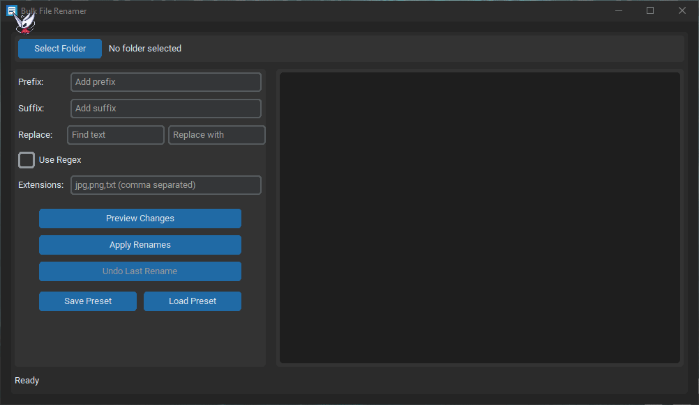

# Bulk File Renamer

Bulk file renaming tool with a CustomTkinter GUI. Preview changes, detect collisions, and undo the last operation.


## Demo



## Features

- Prefix and suffix support
- Find/replace with optional regex
- Extension filtering
- Preview before applying changes
- Collision detection
- Undo last rename
- Preset save/load (JSON)

## Requirements

- Python 3.10+
- `customtkinter`

## Quickstart

```bash
python -m pip install customtkinter
python Bulk_File_Renamer.py
```

## Usage

1. Select a folder.
2. Configure prefix, suffix, find/replace, and extensions.
3. Click `Preview Changes`.
4. Click `Apply Renames`.
5. Use `Undo Last Rename` if needed.

## Presets

Presets are saved as JSON with the current rename configuration.

```json
{
  "prefix": "IMG_",
  "suffix": "_edited",
  "find_text": "screenshot",
  "replace_text": "image",
  "extensions": "jpg,png",
  "use_regex": false
}
```

## Project Structure

- `Bulk_File_Renamer.py` - main application
- `assets/Demo.gif` - demo animation
- `assets/app_icon.png` - app icon (PNG)
- `assets/app_icon.ico` - app icon (Windows)
- `test_files` - sample files for local testing

## Notes

- Only files are renamed, not folders.
- Undo restores the last successful rename batch only.
- On Windows, rename collisions are treated case-insensitively.

## License

MIT License
